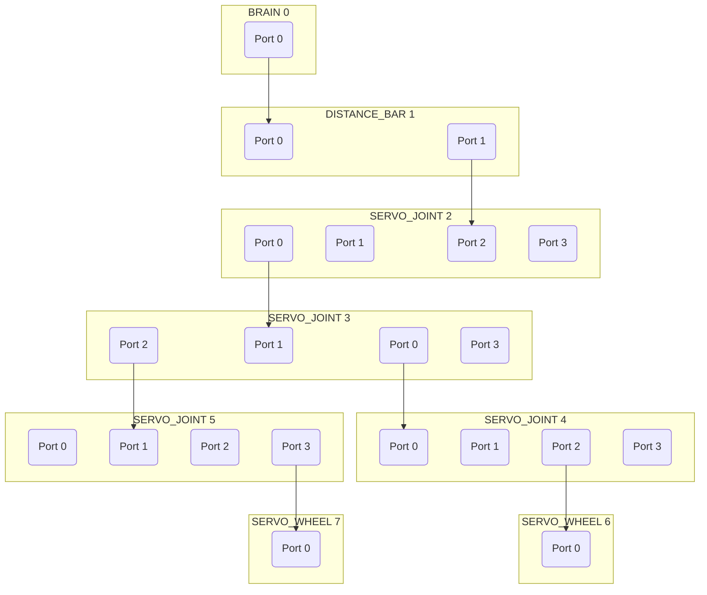

# ClicBot for Node.js (Unofficial)

[](https://badge.fury.io/js/clicbot-unofficial)

> **Unofficial library — not affiliated with, endorsed by, or associated with KEYi Technology or ClicBot.**
> Protocol inferred from network traffic generated by my own device and the official app, solely for interoperability purposes.

Node.js library for controlling ClicBot modular robots — motor control, structure discovery, and event-driven programming over TCP/UDP.

## Install

```bash
npm install clicbot-unofficial
# or
pnpm add clicbot-unofficial
```

```ts
import { ClicBot } from 'clicbot-unofficial';
```

## Connecting to the robot

The robot communicates over TCP. Your computer and the robot must be on the **same IP network**.

There are two network setups:

### WiFi (recommended)

The robot stores WiFi credentials and reconnects automatically on every boot. **The QR code step is only needed once** when joining a new network for the first time.

**First time — provision the robot onto your WiFi:**

```ts
import { buildQrContent, showQrCode, waitForRobot } from "clicbot-unofficial";

const content = buildQrContent({ ssid: "MyWifi", password: "secret" });
await showQrCode(content);        // terminal (default), or pass { mode: "file", path: "qr.png" }
const device = await waitForRobot();
```

Hold the QR code in front of the robot's camera. It joins your network, announces its address, and remembers the credentials from then on.

**Already provisioned — just discover it:**

```ts
import { ClicBotDiscovery } from "clicbot-unofficial";

const device = await ClicBotDiscovery.discoverFirst(5000);
```

### Robot hotspot

The robot can also expose its own WiFi access point. Connect your computer to it, then discover the robot via UDP or connect directly to its known IP.

### Connecting

Once you have the device from either method above:

```ts
import { BrainState, ClicBot } from "clicbot-unofficial";

const bot = new ClicBot();
await bot.connect({ host: device.ip, port: device.port });
bot.sendClientInfo();

bot.on("clientInfo", () => {
    bot.setBrainState(BrainState.CUSTOM);
    bot.requestStructure();
});
bot.on("structure", () => {
    console.log(bot.servoJoints); // ServoJointModule[]
});
```

## Authentication

This library connects in **guest mode only**, using the built-in `tourist` username and `userId: 0`. No account or login is required. This is sufficient for all supported robot control operations.

## Module object API

After calling `requestStructure()`, each physical module is available as a typed object with methods you can call directly:

```ts
bot.on("structure", () => {
    // Access all servo joints
    for (const joint of bot.servoJoints) {
        joint.moveToAngle(0, 60); // move to 0° at 60% speed
    }

    // Access by ID
    const joint = bot.getModule(1) as ServoJointModule;
    joint.rotateStart(true, 30); // continuous forward rotation at 30%
    await new Promise((r) => setTimeout(r, 2000));
    joint.rotateStop();

    // Tree traversal
    for (const child of bot.root!.children) {
        console.log(child.constructor.name, child.id);
    }
});
```

## `ClicBot` API

### Methods

| Method                                            | CMD  | Description                                                  |
| ------------------------------------------------- | ---- | ------------------------------------------------------------ |
| `connect(options)`                                | —    | Open TCP connection                                          |
| `disconnect()`                                    | —    | Close the connection                                         |
| `sendClientInfo(overrides?)`                      | 9    | Send handshake (call on `connect`)                           |
| `setBrainState(state)`                            | 103  | Set brain operating state (`BrainState` enum)                |
| `requestStructure()`                              | 1000 | Request full module tree                                     |
| `setStructureWatchdog(enabled)`                   | 100  | Push notifications on structure change                       |
| `requestAngles(moduleIds?)`                       | 1002 | Poll joint angles                                            |
| `getServoModuleIds()`                             | —    | IDs of all servo joints in current structure                 |
| `root`                                            | —    | Root (brain) module, available after structure               |
| `servoJoints`                                     | —    | All `ServoJointModule` objects in current structure          |
| `servoWheels`                                     | —    | All `ServoWheelModule` objects in current structure          |
| `getModule(id)`                                   | —    | Get any module by ID                                         |
| `servosToPosture(targets)`                        | 1008 | Move servos to absolute angles (bot-level)                   |
| `rotateStart(targets)`                            | 1004 | Begin continuous rotation (bot-level)                        |
| `rotateStop()`                                    | 1006 | Stop all continuous rotation                                 |
| `pushRotate(enabled)`                             | 1010 | Toggle push-rotate (physical drag) mode                      |
| `fullStop(lock?, type?)`                          | 1020 | Emergency stop; optionally lock joints                       |
| `lockModule(id, locked)`                          | 1016 | Lock / unlock a single module                                |
| `lockModules(ids, locked)`                        | 1016 | Lock / unlock multiple modules                               |
| `lockByStructure(locked)`                         | 1016 | Lock / unlock all non-bar modules in current structure       |
| `lockByPosture(ids, locked)`                      | 1016 | Lock / unlock an explicit list of modules                    |
| `executeAction(actionId)`                         | 1014 | Execute a stored action by slot ID                           |
| `executeProgram(actionId)`                        | 1028 | Execute a stored program (Blockly) by slot ID                |
| `uploadSplineResource(action)`                    | 1022 | Upload a custom keyframe motion sequence → `Promise<Buffer>` |
| `controlExecutor(moduleIndex, moduleType, value)` | 200  | Control an executor module                                   |

### Module object methods

| Type               | Method                        | Description                       |
| ------------------ | ----------------------------- | --------------------------------- |
| All modules        | `lock(locked)`                | Lock or unlock this module        |
| `ServoJointModule` | `moveToAngle(angle, speed?)`  | Move to absolute angle in degrees |
| `ServoJointModule` | `rotateStart(forward, speed)` | Begin continuous rotation         |
| `ServoJointModule` | `rotateStop()`                | Stop all continuous rotation      |
| `ServoWheelModule` | `rotateStart(forward, speed)` | Begin continuous rotation         |
| `ServoWheelModule` | `rotateStop()`                | Stop all continuous rotation      |

### Events

| Event                    | Payload                                            | Trigger                          |
| ------------------------ | -------------------------------------------------- | -------------------------------- |
| `connect`                | —                                                  | TCP connection established       |
| `close`                  | —                                                  | Connection closed                |
| `error`                  | `Error`                                            | Socket error                     |
| `heartbeat`              | —                                                  | Heartbeat pulse received         |
| `clientInfo`             | `Record<string, unknown> \| null`                  | Robot's handshake reply          |
| `battery`                | `number` (0–1)                                     | Battery level                    |
| `structure`              | `RawModuleInfo[], Map<number, ClicBotModule>`       | Module topology updated          |
| `angles`                 | `Map<number, number>, Map<number, ServoJointModule>`| Joint angles in degrees          |
| `brainControl`           | `Buffer`                                           | Ack for `setBrainState`          |
| `structureWatchdog`      | `Buffer`                                           | Ack for `setStructureWatchdog`   |
| `servoMoved`             | `Buffer`                                           | Ack for `servosToPosture`        |
| `rotateStarted`          | `Buffer`                                           | Ack for `rotateStart`            |
| `rotateStopped`          | `Buffer`                                           | Ack for `rotateStop`             |
| `pushRotateChanged`      | `Buffer`                                           | Ack for `pushRotate`             |
| `actionExecuted`         | `Buffer`                                           | Ack for `executeAction`          |
| `programExecuted`        | `Buffer`                                           | Ack for `executeProgram`         |
| `locked`                 | `Buffer`                                           | Ack for lock commands            |
| `splineUploaded`         | `Buffer`                                           | Ack for spline upload (cmd 1018) |
| `stopped`                | `Buffer`                                           | Ack for `fullStop`               |
| `splineResourceUploaded` | `Buffer`                                           | Ack for `uploadSplineResource`   |
| `command`                | `TCPDataPacket`                                    | Every received packet (raw)      |

## Custom motion: `uploadSplineResource`

Build a keyframe motion, upload it to a slot, then execute it:

```ts
const [j0, j1] = bot.servoJoints;

const action: ActionDefinition = {
    actionId: 0,
    steps: [
        {
            executeTime: 1.0, // seconds to move
            delayTime: 0.5,   // seconds to hold
            postures: [
                { moduleId: j0.id, angle: 45 },
                { moduleId: j1.id, angle: -45 },
            ],
        },
        {
            executeTime: 0.8,
            delayTime: 0,
            postures: [
                { moduleId: j0.id, angle: 0 },
                { moduleId: j1.id, angle: 0 },
            ],
        },
    ],
};

await bot.uploadSplineResource(action); // resolves on ack
bot.executeAction(0);
```

The full cubic-spline variant (cmd 1018) requires derivative computation via `NativeCubicSpline` (Android JNI) and cannot be reproduced in Node. `uploadSplineResource` uses the simpler keyframe-only format (cmd 1022).

## Structure visualization

`toMermaid(structure)` converts the raw module tree into a [Mermaid](https://mermaid.js.org) graph. Each module becomes a labelled subgraph with one node per port; edges show parent–child connections. See `examples/05-structure/01-mermaid.ts` — it saves `structure.md` and reminds you to paste the content into [mermaid.live](https://mermaid.live).

Example output for a simple arm assembly:



## Not supported

The following features are absent from this library and will not be added without significant further reverse-engineering:

- **Official programs** — the built-in robot configurations shipped by KEYi (commands 300, 400, 401, 1034–1037). These require an authenticated account and upload opaque binary assets.
- **Pro actions / face animations** — the "Pro" timeline system sends a ZIP to the brain (cmd 13) that can include servo splines, video, audio, and `SCREEN` keyframe curves that animate the brain's face display. The wire format of the SCREEN block is not fully understood.
- **Brain face display** — the brain's built-in LCD shows animated eye/face expressions. Expressions are controlled via Pro-action SCREEN data or pre-loaded assets uploaded by the official app. There is no standalone "show expression X" command.
- **Steering / locomotion** — the drive mode for wheeled robots (cmds 1012/1013). The wire format is not known.
- **Cubic-spline upload (cmd 1018)** — requires native derivative computation (`NativeCubicSpline` JNI) that is not available outside Android. Use `uploadSplineResource` (cmd 1022) instead.
- **Veriface / face asset sync** — the brain sends a ZIP of face-expression images and audio to the app (cmd 14) for 3D-preview purposes. Not handled.
- **Guide / activate flow** — the factory calibration and BAC guide channels (cmd 300). Account-gated and device-specific.

## Examples

| Script                               | File                                     | Demonstrates                                              |
| ------------------------------------ | ---------------------------------------- | --------------------------------------------------------- |
| `example:01-connection:01-discovery` | `examples/01-connection/01-discovery.ts` | UDP discovery (`discoverFirst`, streaming)                |
| `example:01-connection:02-basic`     | `examples/01-connection/02-basic.ts`     | Connect, handshake, structure, angles, battery            |
| `example:01-connection:03-qrcode`    | `examples/01-connection/03-qrcode.ts`    | QR-code WiFi connection                                   |
| `example:02-motion:01-servo`         | `examples/02-motion/01-servo.ts`         | `moveToAngle` via module objects, tree traversal          |
| `example:02-motion:02-rotate`        | `examples/02-motion/02-rotate.ts`        | `rotateStart`, `rotateStop`, `pushRotate`                 |
| `example:02-motion:03-lock`          | `examples/02-motion/03-lock.ts`          | `fullStop`, `lock`, `lockByStructure`                     |
| `example:03-actions:01-upload`       | `examples/03-actions/01-upload.ts`       | Upload custom spline resource                             |
| `example:03-actions:02-execute`      | `examples/03-actions/02-execute.ts`      | Execute stored action                                     |
| `example:03-actions:03-bac`          | `examples/03-actions/03-bac.ts`          | Execute stored program (Blockly)                          |
| `example:04-programs:03-executor`    | `examples/04-programs/03-executor.ts`    | Executor module control                                   |
| `example:05-structure:01-mermaid`    | `examples/05-structure/01-mermaid.ts`    | Save module tree as a Mermaid diagram                     |

Run with e.g. `IP=192.168.1.100 pnpm example:01-connection:02-basic`.

## License

MIT © 2026 Hannes Rüger

## Legal / Interoperability Notice

This is an independent, unofficial Node.js library for ClicBot-compatible devices. It is not affiliated with, endorsed by, sponsored by, or associated with KEYi Technology or the ClicBot brand.

The protocol implementation was independently developed by observing network traffic generated by my own device and the official app, solely for the purpose of interoperability. No source code, firmware, binaries, assets, icons, trademarks, private keys, certificates, or other proprietary materials from KEYi Technology are included in this project.

This project is intended to enable lawful control of devices owned by the user. It is not intended to bypass authentication, digital rights management, copy protection, access controls, or any other technical protection measures.

"ClicBot" and related names may be trademarks of their respective owners and are used here only to identify compatibility.
